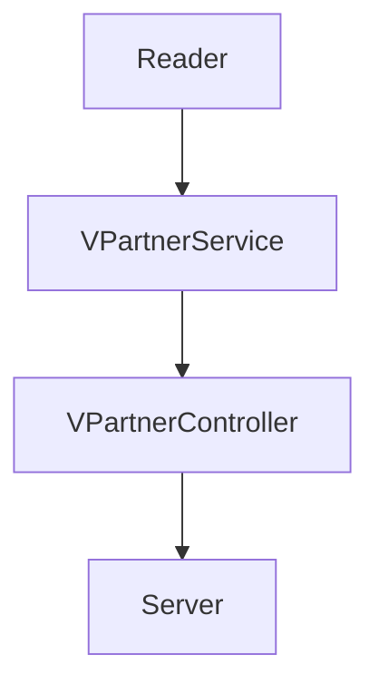
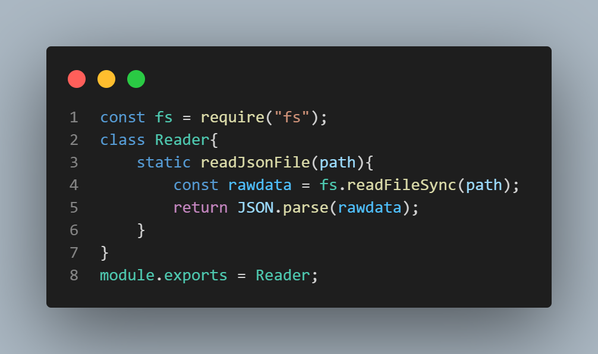
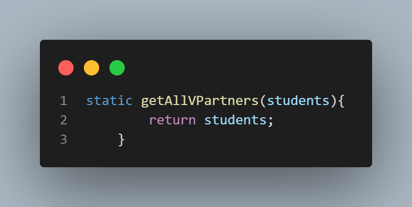
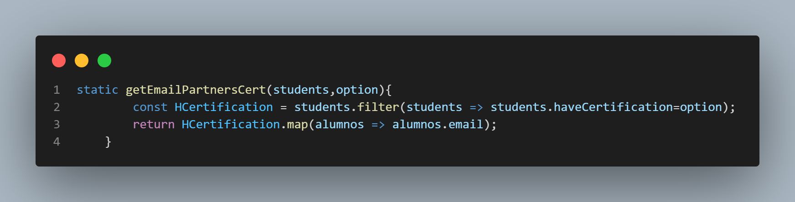
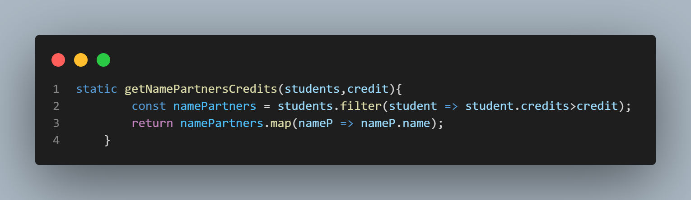
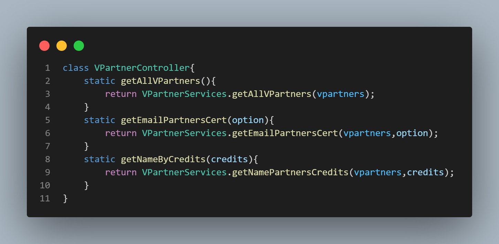

# BackEnd-Semana_4-Code_Challenge
## Launch X | Semana 4 | BackEnd | 5 Code Challenge

## Parte 1: Dependencias Usadas.

Comenzamos el proyecto iniciando el administrador de dependencias `npm init`. Nos crea el archivo `package.json`.

| Dependencia | Comando | Función |
|---|---|---|
|`Jest` | `npm install --save-dev jest` | `Esta dependencia nos permite realizar pruebas de unidad` |
| `EXpress` | `npm install express --save` | `Express nos permite crear un servidor de Node` |
| `ESLint` | `npm install eslint --save-dev`  &&  `npm init @eslint/config` | `Este linter nos da herramientas para cuidar la legibilidad de nuestro código` |

## Parte 2: Diseño

1. La clase `Reader` no permite leer un archivo json.

2. La clase `VPartnerService` nos da los diferentes métodos para cumplir la actividad.
    * El método `getAllVPartners` nos muestra todos los datos de los alumnos.
    
    * El método `getEmailPartnersCert` nos entrega los correos de los alumnos siempre y cuando estos tengan certificado.
    
    * El método `getNamePartnersCredits` nos entrega los nombres de los alumnos con creditos mayores a 500 puntos.
    

3. La clase `VPartnerController` se llaman las funcionalidades de `VPartnerService` para implementarla en el server.
